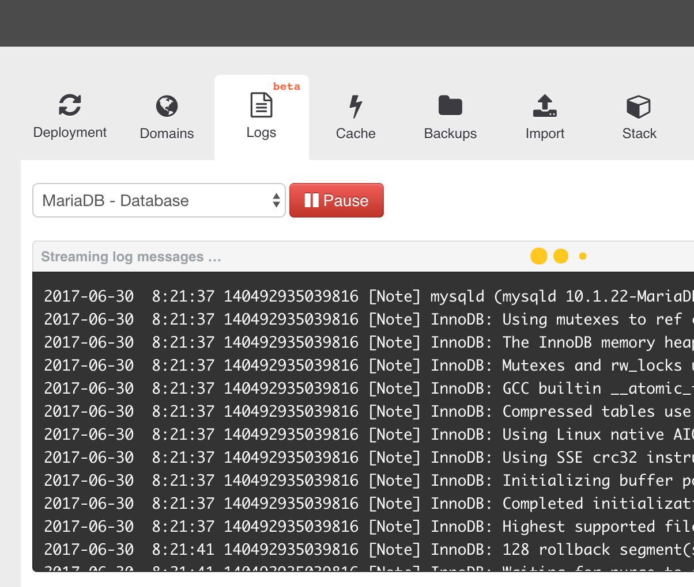

# Logging

Most of the containers used in stack managed by AnaxExp built in a way so all software running in containers stream their logs to the output of container and handled by Docker and Kubernetes. Logs are not persistent, if you restart a container (e.g. happens when you configure a service and redeploy stack) you will lose it.

There 2 ways to get your applications logs:

## Log streaming from dashboard

Go to `Instance > Logs`, choose a service (container) and click Stream. Last N log messages will be fetched, plus all new messages will be shown in real-time.
​

​
​
## CLI with kubectl

Go to `Instance > Stack > Service` and copy `Show logs command`. Connect to the host server as root and run the command. Adjust the value of tail param to specify how many messages to fetch. For more params see [kubectl logs reference](https://kubernetes.io/docs/user-guide/kubectl/v1.7/#logs).

Some software may additionally store their application logs in files inside of a container

In some cases you can stream application's logs (e.g. watchdog in Drupal stack) to an additional syslog container via modules/libraries like Monolog.