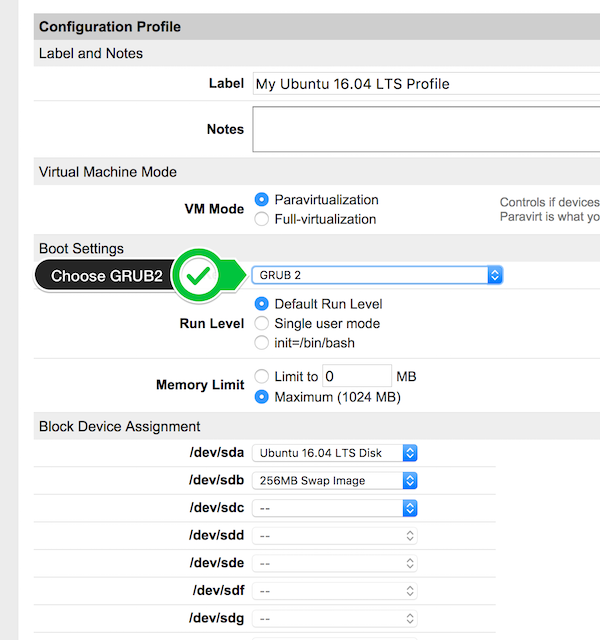

# Linode

## Connecting Linode server

Currently, we don't have a native integration with Linode. But you still can connect your server by following these steps: 

0. Learn [requirements and recommendations](../infrastructure/connecting-server.md#requirements-and-recommendations) 

1. Login to [Linode manager](https://manager.linode.com) 

2. Spin up a new linode

3. Wait for linode being created. Once its status is set to "Brand New". Navigate to this linode dashboard

4. Click "Deploy an image"

5. By default Linode uses a custom Linux Kernel version, we should replace it to the Kernel version that comes with the Linux distribution. Click Edit to view a distribution’s configuration profile options as shown below and change Kernel to `GRUB2`:

6. Choose image attributes (list of [supported OS](../infrastructure/connecting-server.md#supported-os) and deploy

7. Wait until all disks are create and boot the linode

8. Now it's all set on Linode's side. Now connect the server (`Servers > Connect > Linode`) and follow the instructions